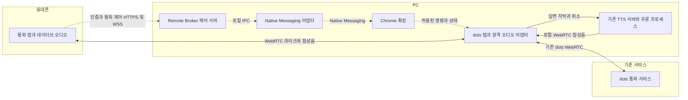

# Dots Voice 모바일 원격 통화 설계

2026-10-01 작성. 이 문서는 **구현 전 설계안**이다. 현재 데스크톱 기능과 앞으로 추가할 기능을 구분하며, 아래 API·상태·시간 제한은 새로 제안하는 계약이다.

목표는 모바일 앱의 통화 버튼으로 PC의 dots 통화를 시작하고, 휴대폰 마이크로 말하며 현재의 고정 참조 목소리를 휴대폰에서 듣는 것이다. dots 로그인·대화·자막 처리와 Qwen3-TTS 추론은 PC에서 유지한다. 모바일에 모델이나 ChatGPT 계정 인증 정보를 복사하지 않는다.

핵심 결정은 **PC 서버는 통화 제어와 연결 설정을 담당하고, 실제 음성은 모바일 앱과 PC Chrome 사이의 WebRTC로 전달한다**는 것이다. 기존 TTS 서버는 계속 PC 내부에서만 접근한다. 최초 연결 이후의 일반적인 통화는 휴대폰에서 시작·종료할 수 있어야 한다. 브라우저 재시작·로그인 만료·오디오 권한 문제까지 무조건 무인 복구된다고 가정하지 않는다.

## 1. 범위와 확인된 기반

첫 PC 대상은 macOS Apple Silicon과 Chrome이다. 모바일 프로토콜은 iOS·Android 공통으로 정의하고, 오디오·백그라운드 처리는 플랫폼별로 구현한다. Windows는 기존 TTS 경로를 재사용할 수 있지만 전체 원격 통화 지원 판정은 해당 실기기 검사 후 별도로 한다.

사용자는 M5와 M3 24GB에서 현재 통화가 잘 동작했다고 보고했다. 수치가 기록된 기존 측정은 [MEASUREMENTS.md](MEASUREMENTS.md)의 M5 결과이며, M3의 메모리·지연·장시간 성능을 측정한 것으로 취급하지 않는다.

| 항목 | 현재 구현 | 모바일 원격 통화에서 추가할 것 |
| --- | --- | --- |
| dots 통화 시작 | 사용자가 웹에서 시작 | 선택한 dot의 통화 UI 제어와 성공 확인 |
| 마이크 | dots가 PC 마이크 사용 | 모바일 음성을 dots 송신 트랙에 공급 |
| 답변 자막 | 페이지의 WebRTC 데이터 채널 관찰 | 기존 처리 재사용, 통화 소유권 검사 |
| 합성 | 고정 참조 WAV와 플랫폼별 Base 모델 | 현재 모델·revision·참조 음성 유지 |
| 음성 재생 | 브라우저의 Web Audio 출력 | 처리된 TTS 트랙을 모바일로 전송 |
| 제어 연결 | 팝업 작업 중 Native Messaging | 원격 대기 중 지속 연결과 상태 재동기화 |
| 인증 | 고정 확장 ID와 로컬 TTS 토큰 | 모바일 기기 페어링과 통화별 권한 |

한 PC에서 한 통화만 허용하고, 하나의 등록된 모바일 기기가 그 통화를 소유한다. 여러 기기를 등록할 수 있지만 동시 통화·자동 기기 인계는 첫 버전에서 제외한다. 통화 대상도 사용자가 PC에서 등록한 dot 하나로 시작한다. 모바일에서 임의 URL이나 JavaScript를 전달하는 기능은 만들지 않는다.

PC 웹 연결에 관한 기존 서비스 의존성과 이용상 주의는 [README.md](../README.md)에 그대로 적용된다. 이번 설계는 실제 음성 설정이나 배포 지원 범위를 변경하지 않는다.

## 2. 전체 연결 구조

아래에서 점선은 제어 메시지, 실선은 미디어 또는 자막 처리 경로다. PC 브라우저에는 dots 연결, 로컬 TTS 연결, 모바일 연결이라는 서로 다른 세 WebRTC 연결이 존재한다.



그림의 제어 경로는 응답·상태 이벤트도 반대 방향으로 운반한다. 시그널링은 WebRTC 연결을 만들기 위한 SDP와 ICE 후보 교환을 뜻한다. 모바일 연결의 시그널링만 Broker를 경유하며, 연결 후 음성 패킷은 직접 오가거나 필요한 경우 TURN 서버를 경유한다. [WebRTC 연결 문서](https://webrtc.org/getting-started/peer-connections), [TURN 문서](https://webrtc.org/getting-started/turn-server).

### 음성 입력

모바일 마이크 → 모바일의 에코 제거 → 모바일 WebRTC 송신 → PC 탭의 모바일 수신 트랙 → 입력 게이트 → dots 송신 트랙 → 기존 dots 서비스.

### 음성 출력

dots 답변 자막 → 기존 구절 버퍼 → 기존 Qwen3-TTS → 브라우저의 TTS 수신 트랙 → 취소·음량 처리가 적용된 출력 게이트 → 모바일 WebRTC 송신 → 모바일 재생.

원래 dots 수신 음성은 재생하지 않는다. PC의 시스템 사운드 전체를 캡처하지 않고, 현재 통화의 TTS 출력만 전달한다. 로그인·알림·다른 탭 소리가 모바일로 섞이지 않는 구성이다.

Broker를 별도의 음성 디코더·인코더로 사용하지 않아 중계 단계 하나를 줄인다. 다만 현재 TTS의 로컬 WebRTC를 재사용하면 브라우저에서 디코딩 후 모바일용으로 다시 인코딩하는 비용은 남는다. 이 비용은 측정한다. 성능이 부족할 때 TTS에서 모바일로 직접 보내는 구성을 후속 비교하며, 첫 구현에서는 안정된 자막·취소 경로의 재사용을 우선한다.

## 3. 실행 구성과 책임

| 구성 | 제안 기술 | 책임과 수명 |
| --- | --- | --- |
| iOS 앱 | Swift 기반 UI와 네이티브 WebRTC | 통화 UI, 오디오 세션, 기기 키 보관. 통화 중에만 마이크 사용 |
| Android 앱 | Kotlin 기반 UI와 네이티브 WebRTC | 같은 프로토콜, 오디오 포커스, 통화 중 foreground service |
| Remote Broker | Python 3.11과 aiohttp | TLS API·WSS, 기기 인증, 통화 상태, 자원 예약. 원격 대기 동안 상주 |
| Native Host 어댑터 | 기존 Python 실행기 확장 | 확장 ID 검증, Broker와 로컬 IPC, 기존 TTS 시작·offer 처리 |
| Chrome 확장 | 기존 MV3 확장에 기능 추가 | 대상 탭 관리, 통화 UI 어댑터, 지속 Native Messaging, 페이지 코드 주입 |
| 페이지 오디오 어댑터 | JavaScript와 Web Audio·WebRTC | 모바일 입력 공급, TTS 출력 전달, 게이트·연결 감시 |
| TTS 서버·worker | 기존 aiohttp·aiortc·MLX 경로 | 고정 목소리 합성, 큐·취소, 추론 프로세스 관리 |

모바일 UI 프레임워크를 바꾸더라도 오디오 처리와 프로토콜 계약은 유지한다. WebView 안에서 전체 통화를 구현하는 방식은 기본안으로 선택하지 않는다. 잠금 화면·이어폰·실제 전화에 의한 중단을 각 OS의 오디오 수명에 맞춰 처리해야 하기 때문이다.

PC의 원격 대기는 확장 팝업에서 사용자가 켜고 끈다. 팝업에 PC 상태, 등록 기기, 선택한 dot, 페어링 QR, 원격 대기 해제 기능을 추가한다. Broker의 관리 기능은 Native Messaging과 로컬 IPC로 호출하며, 모바일 API로 PC 임의 설정을 변경할 수 없게 한다.

Broker와 Native Host는 macOS에서 사용자 전용 Unix domain socket, Windows에서 사용자 ACL이 적용된 named pipe를 사용한다. IPC 접속에는 설치별 비밀도 확인한다. 브라우저와의 stdio 연결은 Chrome이 시작한 Native Host가 소유하며, Broker가 Chrome에 직접 Native Messaging 연결을 여는 것으로 설계하지 않는다.

Broker가 통화 상태의 기준이다. 확장·페이지·앱은 자기 자원의 관측 상태를 보고한다. Broker의 명령 수락과 실제 연결 성공은 구분한다. TTS 프로세스가 살아 있어도 모델 준비가 끝나지 않았다면 `PREPARING`이다.

`MediaStream`과 오디오 노드는 페이지 안에서만 다룬다. 확장·Native Host·Broker 사이에는 JSON 명령과 상태만 전달한다. 확장 메시지로 `MediaStream` 객체 자체를 옮길 수 있다고 가정하지 않는다. TTS 실행기가 읽는 기존 로컬 인증 토큰도 이 경계를 넘지 않는다.

## 4. 최초 등록과 원격 대기

최초 설치와 로그인은 PC에서 한 번 진행한다.

1. 기존 설치 절차로 Chrome 확장을 사용자가 등록하고 dots에 로그인한다.
2. 사용할 dot의 대화 탭에서 확장의 원격 대기를 켠다. 확장이 대화 경로를 로컬 대상 ID에 묶는다.
3. 확장이 원격 기능에 필요한 사이트 권한을 요청하고, PC 페이지의 오디오 활성화를 검사한다.
4. Broker가 페어링 QR을 만들고 사용자가 앱으로 스캔한다. PC에서 표시된 기기를 승인한다.
5. 모바일 마이크 권한·오디오 경로와 PC 준비 상태를 검사하고, 앱에 통화 가능 여부를 표시한다.

현재 `activeTab`은 사용자 동작으로 얻는 임시 권한이다. 같은 origin 내 이동과 다른 origin 이동의 수명이 다르며, 새 탭·브라우저 재시작까지 원격 접근을 보장하지 않는다. 원격 기능용으로 `optional_host_permissions: ["https://chatgpt.com/*"]`를 제안한다. 권한은 PC의 명시적 클릭으로 요청하고, 실제 코드 실행은 등록한 `/dots/...` 경로·탭·문서에만 제한한다. 기존 로컬 사용자는 원격 권한 없이도 기존 기능을 사용할 수 있어야 한다. [activeTab](https://developer.chrome.com/docs/extensions/develop/concepts/activeTab), [선택 권한](https://developer.chrome.com/docs/extensions/reference/api/permissions).

원격 대기에서는 확장이 `connectNative()` 포트를 유지한다. 현재 `enable()` 종료 시 포트를 닫는 동작과 분리된 연결이다. 원격 명령은 이 포트를 통해 Broker에서 확장으로 전달한다. 연결 유지가 service worker의 수명에 도움이 되더라도 종료 가능성을 전제로 설계한다. 재시작 시 전역 Map을 복원된 진실로 취급하지 않고 Broker와 페이지의 상태를 다시 맞춘다. 원격 대기를 끄면 지속 포트도 닫는다. [Chrome 수명 문서](https://developer.chrome.com/docs/extensions/develop/concepts/service-workers/lifecycle).

### 자동 시작의 실제 한계

사이트 권한과 Web Audio 사용자 활성화는 서로 다른 조건이다. `HTMLElement.click()`을 호출했다고 실제 사용자 클릭 권한을 얻었다고 보지 않는다. 모바일의 통화 버튼도 PC 페이지에 사용자 활성화를 자동 전달하지 않는다. `AudioContext.state`, 사이트의 통화 UI, 연결 상태를 각각 검사해야 한다. [Chrome 자동 재생 정책](https://developer.chrome.com/blog/autoplay).

따라서 `READY`는 로그인됨·확장 연결됨·대상 확인됨·오디오 준비됨이 확인된 상태다. 새 문서나 재시작 후 오디오 활성화가 막히면 `LOCAL_ACTION_REQUIRED`를 표시한다. 보안 플래그, Chrome 프로필·권한 DB 수정, 자동화 탐지 우회로 해결하지 않는다. 첫 실험에서 실제 사용자 조작 없이 통화 시작이 되는지 확인하기 전에는 완전 자동 연결을 완료했다고 보고하지 않는다.

## 5. 통화 시작과 종료 순서

### 시작

1. 사용자가 앱의 통화 버튼을 누른다. 앱이 마이크 권한과 오디오 세션을 준비하고 `call.start`를 보낸다. 이 단계에서는 마이크 전송 게이트를 닫아 둔다.
2. Broker가 기기 권한·대상·PC 준비 상태를 확인하고 `callId`를 발급한다. 다른 로컬 또는 원격 통화가 있으면 `BUSY`로 끝낸다.
3. 기존 실행기로 TTS를 시작하거나 재사용한다. 모델 준비가 완료될 때까지 앱에 준비 상태를 전달한다. 대기 중 취소도 처리한다.
4. 확장이 정확한 탭과 `documentId`를 다시 확인하고, 새 통화 전에 자막·오디오 후크와 입력 대체 코드를 설치한다. 이미 진행 중인 수동 통화에는 들어가지 않는다.
5. 기존 로컬 TTS offer/answer를 교환한다. TTS 재생 준비, 모바일용 WebRTC·제어 채널, 무음 입력 트랙을 준비한다. 앱과 탭 사이의 실제 미디어 연결까지 확인한다.
6. dots UI 어댑터가 등록된 대화의 통화 시작 버튼을 누른다. 통화 연결 이벤트와 예상 오디오·자막 경로를 관찰한다. 첫 답변 텍스트가 오기까지 무조건 기다리는 조건은 두지 않는다.
7. dots 연결·TTS·모바일 미디어·입력 경로가 모두 준비되면 Broker가 `ACTIVE`를 보낸다. 앱과 페이지의 입력 게이트를 열고 모바일 재생을 활성화한다. 시작 중 도착한 인사는 제한된 텍스트 큐에 보관했다가 이때 TTS에 보낸다. 출력이 닫힌 상태에서 먼저 합성·송신해 인사 앞부분을 잃지 않게 한다.

통화 UI 어댑터의 `inspect()`, `start()`, `hangup()`은 새로 구현할 내부 인터페이스다. 특정 CSS 선택자나 비공개 서버 API가 존재한다고 가정하지 않는다. 실제 dots 화면의 버튼 역할·접근 가능한 이름·연결 상태를 확인해 어댑터를 작성하고, 버튼이 없거나 여러 개면 클릭하지 않고 오류를 반환한다. 자동 시작 실패 시 무한 재클릭하지 않는다.

### 종료

1. 앱은 종료 버튼을 누른 즉시 자신의 마이크 송신과 재생을 끈다. 서버 응답을 기다리며 계속 녹음하지 않는다.
2. Broker가 통화를 `ENDING`으로 바꾸고 입력·출력 게이트 닫기, TTS 큐 비우기, dots 종료를 요청한다.
3. 확장이 소유한 통화의 종료 UI를 실행하고 종료 상태를 확인한다. 실패 시 정확히 식별된 dots peer를 닫아 미디어를 중단한다.
4. 모바일 peer, TTS peer, 소유한 트랙·타이머를 해제한다. dots 통화가 끝났다는 확인 후 페이지 후크를 복원한다. TTS 모델은 설정한 유휴 시간 동안 따뜻하게 유지할 수 있다.
5. 종료 확인이 불명확하면 `ORPHANED`로 남기고 새 통화를 막는다. PC에서 정리하거나 신뢰할 수 있는 상태 확인이 끝난 뒤 예약을 해제한다. dots에 이미 맡긴 별도 작업을 취소하는 명령은 보내지 않는다.

시작 처리 중에 종료가 도착하면 같은 `callId`를 취소 상태로 남긴다. 늦게 끝난 모델 로딩·offer·UI 클릭 작업은 취소 상태를 다시 확인하고 통화를 재개하지 않는다.

## 6. PC 브라우저 오디오 처리

### 세 연결의 식별

현재 코드는 원래 `RTCPeerConnection` 생성자를 보관하고 dots의 새 연결을 감싼다. 모바일 peer도 보관한 원래 생성자로 생성해 dots 관찰 대상에서 제외한다. `dotsPc`, `ttsPc`, `mobilePc`를 명확히 구분한다. 오디오 sender 하나가 있다는 이유만으로 첫 번째 연결을 선택하지 않는다.

통화 어댑터는 `callId`, 대상 탭, `documentId`, 관찰한 dots peer를 묶는다. 페이지 이동이나 문서 교체는 기존 통화의 소유권을 무효화한다. 연결 재수립이 필요해도 다른 탭의 통화를 자동으로 가져오지 않는다.

### 모바일 입력 공급

기본안은 페이지 내부에 **지속되는 합성 마이크 트랙**을 만드는 것이다. 모바일 수신 음성을 `MediaStreamAudioSourceNode → inputGain → MediaStreamAudioDestinationNode`로 연결하고, dots가 통화 시작 중 요청하는 오디오 `getUserMedia()`에 이 스트림을 제공한다. 입력이 없으면 같은 트랙에서 무음을 공급한다. PC 실제 마이크는 이 경로에서 열지 않는다.

이 후크는 원격 모드의 등록된 통화 시작 구간에만 적용하며, 오디오 요청 조건·취소·`track.stop()`·재시도에 맞춰 수명을 관리한다. 대상이 아닌 요청에 모바일 음성을 넘기지 않는다. 예상과 다른 캡처 요청이나 기존에 캐시된 미디어 경로를 발견하면 시작을 멈추고 호환성 오류를 보고한다.

대안은 정확히 식별한 dots sender의 `replaceTrack()`으로 합성 입력을 교체하는 것이다. 같은 종류의 트랙 교체를 지원하지만 채널 수 등 조건 때문에 거절될 수 있다. 이를 무조건 성공하는 보조 경로로 취급하지 않고, 첫 실험에서 기본안과 비교한다. 어느 쪽이든 PC 마이크가 잠시라도 송신되는 구간을 허용하지 않는다. [트랙 교체 API](https://developer.mozilla.org/en-US/docs/Web/API/RTCRtpSender/replaceTrack).

합성 마이크를 고정하면 모바일 peer 재연결 시 입력 source만 교체할 수 있다. 현재 dots 통화를 다시 걸 필요가 줄어든다. 사용자가 dots 자체 음소거를 누른 경우도 존중하며, 원격 앱이 임의로 다시 켜지 않는다.

### TTS 출력 전달

현재 `dots-tts.js`의 출력 그래프는 TTS 수신 트랙을 gain·analyser를 거쳐 PC 스피커로 보낸다. 이를 로컬 모드와 원격 모드로 분리한다. 원격 모드는 **기존 취소 gain 뒤**에 `MediaStreamAudioDestinationNode`를 연결하고 그 트랙을 `mobilePc`에 보낸다. 생 TTS 트랙을 그대로 복제하면 취소 시 음소거 처리를 놓치므로 사용하지 않는다. [Web Audio 스트림 출력](https://developer.mozilla.org/en-US/docs/Web/API/AudioContext/createMediaStreamDestination).

원격 모드에서는 PC 스피커로의 연결을 제거하고, 원래 dots 음성도 계속 음소거한다. 현재 `ready()`의 로컬 재생 조건을 전송 준비 조건과 분리해야 한다. 현재 `fallback()`은 원음을 다시 켜므로, 원격 모드에서는 게이트를 닫고 오류를 보고하는 별도 정책이 필요하다. 연결 실패가 원래 목소리의 갑작스러운 재생으로 이어져서는 안 된다.

## 7. 오디오 품질과 말 끊기

모바일 연결은 오디오 전용 WebRTC, Opus를 기본으로 한다. 48kHz mono 처리와 20ms 패킷을 초기 목표로 삼되 실제 협상 결과를 확인한다. 비트레이트는 초기 24~48kbps 범위에서 평가하고, 라이브러리가 지원하는 방식으로 FEC·혼잡 제어를 사용한다. 전송 계층 수치와 모델의 320ms 합성 청크 간격을 혼동하지 않는다.

에코 제거는 마이크와 스피커가 함께 있는 모바일에서 처리한다. WebRTC 네이티브 오디오 계층과 OS 음성 처리 설정을 맞추고, 독립된 AEC를 무작정 두 번 적용하지 않는다. PC 입력은 이미 처리된 모바일 음성이므로 추가 마이크 잡음 억제·AGC를 강제하지 않는다. 첫 실험은 이어폰으로 하고, 스피커폰에서 자기 답변이 사용자 발화로 인식되는지 따로 검사한다.

### 중단 프로토콜

현재 자막 기반 `input_transcript.added` 취소는 유지한다. 원격 경로에는 앱의 중단 버튼과 선택적 모바일 VAD를 추가한다. VAD는 에코 제거가 된 입력에서만 동작하고, 사용자 음소거 중에는 중단 이벤트를 만들지 않는다.

1. 모바일이 말하기 시작을 감지하거나 중단 버튼을 누르면 즉시 로컬 출력 게이트를 닫는다.
2. 현재 통화의 `interruptId`를 빠른 DataChannel과 WSS로 전달한다. 중복은 같은 ID로 제거한다.
3. 페이지는 기존 구절 버퍼의 `interrupt()`를 호출하고 `flush`를 보낸다. TTS는 현재의 내부 epoch를 증가시키며 큐와 PCM을 비운다.
4. 사용자 입력은 dots로 계속 전달한다. TTS 중단 자체가 dots 서버의 답변 생성 취소를 보장하지는 않는다. 후속 자막은 기존 사용자·assistant 턴 처리와 연결한다.
5. 새 assistant 턴과 새로운 재생 준비가 확인된 후 모바일 출력을 다시 연다. 단순히 150ms 타이머가 끝났다는 이유로 이전 답변을 다시 재생하지 않는다.

새 `playbackEpoch`는 페이지와 앱의 재생 상태를 구분하는 제어 번호이며, 기존 TTS 내부 epoch와 같은 값이라고 가정하지 않는다. **제어 메시지에 epoch를 붙여도 RTP 패킷에 자동으로 붙지 않는다.** 서버 큐를 비웠다고 모바일 jitter buffer가 즉시 비워지는 것도 아니다.

첫 구현은 음소거 중에도 수신을 소비하고, 네이티브 오디오 어댑터의 재생 버퍼 재동기화와 새 턴 게이트를 검증한다. 오래된 음성이 다시 들리는 문제가 남으면 미디어 연결을 새로 만들어 이전 스트림을 폐기한다. `replaceTrack()`만으로 jitter buffer가 초기화된다고 가정하지 않는다. 새 음성 시작 신호와 오디오 도착의 순서 차이를 테스트하며, 이 검증이 끝나기 전에는 즉각적인 말 끊기를 완성했다고 평가하지 않는다.

장시간 응답에 대해 무한히 음성을 쌓지 않는다. 초기 상한은 합성 완료 후 대기 PCM 5초, 대기 텍스트 8구절로 제안한다. 제한에 도달하면 신규 합성을 보류하고 상류 텍스트를 제한된 범위에서 보관한다. 텍스트 상한도 넘으면 `OUTPUT_BACKLOG`로 현재 답변을 중단한다. 문장 일부를 조용히 버리고 정상 재생이라고 보고하지 않는다. 실제 임계값은 발화 속도와 합성 속도 측정 후 조정한다.

한 구절이 5초보다 길 수 있으므로 큐 상한 검사는 요청 단위뿐 아니라 PCM 생성·IPC 전달에도 적용한다. 소비 속도에 맞춰 생성 측을 대기시키는 backpressure와 취소 시 대기 해제를 구현해야 한다. 현재의 `call_soon_threadsafe` 예약만으로 메모리가 제한된다고 보지 않는다. 초기 텍스트 큐에는 구절 수와 함께 총 2,400자 상한을 둔다.

## 8. 상태와 통화 소유권

PC 준비 상태와 통화 상태를 분리한다. PC 준비 상태는 `OFFLINE`, `BROWSER_UNAVAILABLE`, `LOCAL_ACTION_REQUIRED`, `READY`, `BUSY`다. 앱은 실패한 조건에 맞는 문구를 표시한다.

| 통화 상태 | 의미 | 다음 처리 |
| --- | --- | --- |
| `PREPARING` | 대상 예약·TTS 준비·후크 설치 | 준비 완료 또는 취소·실패 |
| `CONNECTING` | 모바일 미디어와 dots 연결 중 | 모든 준비 조건 확인 후 `ACTIVE` |
| `ACTIVE` | 양방향 통화 가능 | 음소거·중단·종료·연결 장애 |
| `RECONNECTING` | 통화는 남아 있고 모바일 연결 복구 중 | 게이트 닫기, 같은 통화 재접속 |
| `ENDING` | 송신·재생 중지, dots 종료 확인 중 | `ENDED` 또는 `ORPHANED` |
| `ENDED` | 자원이 정리된 종료 | 새 통화 가능 |
| `FAILED` | 시작 실패 또는 확정된 종료 오류 | 정리 확인 후 재시도 가능 |
| `ORPHANED` | dots 종료 여부나 자원 소유권 불명확 | 새 통화 차단, PC 복구 필요 |

`muted`, `userSpeaking`, `ttsPlaying`, `audioInterrupted`는 별도 상태값이다. 음소거를 새로운 통화 상태로 만들어 재연결·종료 상태와 충돌시키지 않는다.

Broker는 `(hostEpoch, callId, deviceId, targetId)`를 소유권 단위로 사용한다. 브라우저에는 `(browserInstanceId, tabId, documentId)`를 추가하고, 연결 재협상에는 `mediaRevision`을 붙인다. 예전 문서·통화·revision의 늦은 응답을 현재 상태에 적용하지 않는다.

통화 예약은 기존 로컬 모드에도 적용한다. 현재 여러 peer가 하나의 추론 엔진을 공유할 수 있으므로 Broker의 메모리 lock만으로 충분하지 않다. TTS 서비스에 소유자 예약·갱신·해제와 활성 peer 확인을 추가하고, 로컬 `offer` 경로도 같은 예약을 받게 한다. 기존 로컬 사용 절차는 유지하되 원격 통화 중 새 로컬 연결에는 `BUSY`를 반환한다. 이미 진행 중인 로컬 통화를 강제로 끊지 않는다.

예약은 TTS 모델 준비 후 획득하고 offer 생성 전에 유효해야 한다. PC 서버·확장이 사라졌을 때는 TTL 만료로 관련 TTS peer를 종료한다. 웹 통화까지 종료됐다는 증거가 없으면 Broker의 `ORPHANED` 상태는 자동 해제하지 않는다.

예약 초기값은 5초마다 갱신, 마지막 갱신 후 20초 만료로 제안한다. Broker 재시작은 hostEpoch를 바꾸고, 이전 통화의 소유권을 자동 인수하지 않는다. 알려진 peer를 정리하거나 상태를 확인할 때까지 새 예약을 보류한다.

## 9. 통신 계약

### 네트워크 표면

기존 `127.0.0.1:8766`의 TTS HTTP 서버는 유지한다. Broker의 모바일 TLS 포트는 초기 기본값 `8767`로 제안하며 설정 가능하게 한다. 포트 충돌 시 다른 프로세스를 종료하지 않고 오류를 반환한다. LAN 모드는 사용자가 선택한 사설 인터페이스에만 바인딩하며 모든 인터페이스 공개를 기본값으로 삼지 않는다.

| 인터페이스 | 인증 | 용도 |
| --- | --- | --- |
| 로컬 IPC `pair.create`, `pair.approve`, `device.revoke`, `remote.disable` | 사용자 전용 IPC와 설치별 자격 | PC에서만 기기 관리 |
| `POST /v1/pair/claim` | QR의 일회용 ticket와 기기 공개 키 | 기기 등록 요청 |
| `GET /v1/pair/status` | 등록 요청에 한정된 임시 확인 토큰 | PC 승인·거절·만료 확인 |
| `POST /v1/auth/challenge` | 제한된 공개 진입점 | 짧은 수명의 서명 nonce 발급 |
| `POST /v1/auth/session` | 등록 기기 키로 nonce 서명 | 짧은 수명의 세션 토큰 발급 |
| `GET /v1/status` | 세션 토큰 | PC 준비 상태·자기 통화 조회 |
| `WSS /v1/control` | 헤더의 세션 토큰 | 명령·이벤트·SDP·ICE |

도전값은 서버 ID·기기 ID·발급 시각·무작위 nonce에 묶고 한 번만 쓴다. 세션 토큰은 해당 기기와 PC에 묶인 범위를 가지며 초기 유효기간은 15분으로 제안한다. 앱이 살아 있는 통화에서는 만료 전에 키 증명으로 갱신하고, 갱신 실패 시 게이트를 닫는다. 토큰을 URL이나 일반 로그에 넣지 않는다.

### 메시지 봉투

다음은 설명용 예시이며 실제 계정·기기·토큰이 아니다.

```json
{
  "version": 1,
  "type": "call.start",
  "requestId": "example-request-id",
  "hostEpoch": "example-host-epoch",
  "callId": null,
  "payload": {
    "targetId": "registered-dot",
    "output": "tts"
  }
}
```

`deviceId`는 본문을 믿지 않고 인증 세션에서 구한다. 시작 응답은 `accepted`와 `callId`를 돌려주며, 연결 완료는 이후 `call.state` 이벤트로 알린다. 같은 `requestId`의 재전송은 같은 결과를 반환한다. 서로 다른 시작 요청도 이미 자기 통화를 준비 중이면 같은 통화 상태를 돌려주고 두 번 클릭하지 않는다. 시작 응답을 받기 전에 사용자가 취소하면 `call.cancel`에 원래 start의 requestId를 지정한다. 서버는 해당 시작 요청의 취소 기록을 남겨 늦은 처리나 재전송이 통화를 만들지 못하게 한다.

| 방향 | 종류 | 핵심 규칙 |
| --- | --- | --- |
| 앱 → Broker | `call.start` | 등록 targetId만 허용, 한 통화 예약 |
| 앱 → Broker | `call.cancel`, `call.hangup` | 자기 callId만 종료, 반복 호출 안전 |
| 앱 → Broker | `call.set_mute` | toggle 대신 원하는 boolean 값 전달 |
| 앱 → Broker | `call.set_audio_available` | OS 중단·출력 경로 상실을 보고, 입력·출력 게이트 닫기 |
| 앱 → Broker | `call.interrupt` | interruptId 중복 제거, 해당 통화만 취소 |
| 양방향 | `rtc.offer`, `rtc.answer`, `rtc.ice` | callId·mediaRevision·peer 역할 검사 |
| 앱 → Broker | `session.resume` | 마지막 eventSeq 이후 이벤트 또는 현재 스냅샷 |
| Broker → 앱 | `call.state`, `call.error`, `host.status` | 단조 증가 eventSeq와 관측 상태 |
| 앱 ↔ 페이지 | `heartbeat`, `interrupt`, `playback.state` | 이미 인증된 모바일 peer의 작은 DataChannel 메시지 |

모바일이 offer를 만드는 역할로 고정한다. 재협상 요청은 Broker가 revision을 올린 뒤 앱에 지시하며 양쪽이 동시에 offer를 만드는 상황을 피한다. ICE 후보는 해당 remote description 적용 후 처리하고, 이전 revision 후보는 버린다. 시그널링은 인증된 경로에서 교환하여 SDP의 DTLS fingerprint까지 연결 상대에 묶는다.

WebSocket 제어 메시지는 최대 128KiB, SDP는 최대 100KB로 제한한다. 현재 Native Messaging 제한과 정합성을 유지하고 큰 후보 묶음은 나누어 보낸다. 후보 개수·메시지 빈도·재시도 횟수도 제한한다. 이벤트 기록은 최근 256개 또는 10분만 메모리에 보관하고, 범위를 벗어난 resume에는 상태 스냅샷을 반환한다. 재생 오디오는 재접속 시 과거분을 재전송하지 않는다.

### 오류 코드

`HOST_OFFLINE`, `BROWSER_UNAVAILABLE`, `LOGIN_REQUIRED`, `LOCAL_ACTION_REQUIRED`, `TARGET_UNAVAILABLE`, `BUSY`, `TTS_START_FAILED`, `CALL_START_FAILED`, `MEDIA_CONNECT_FAILED`, `PROTOCOL_MISMATCH`, `SESSION_REVOKED`, `OUTPUT_BACKLOG`, `CALL_CLEANUP_REQUIRED`를 정의한다. 사용자에게는 원인과 필요한 행동을 짧게 표시하고, 내부 예외·개인 경로·SDP를 그대로 노출하지 않는다.

## 10. 페어링과 외부 접속

PC는 TLS 키와 설치 ID를 생성하고, 모바일은 기기별 서명 키를 생성해 Keychain 또는 Android Keystore로 보호한다. QR에는 버전, PC ID, 연결 주소, TLS 공개 키 지문, 128bit 이상 무작위 일회용 ticket를 포함한다. ticket 초기 수명은 2분이며 성공 시 소비하고 실패 횟수를 제한한다. 앱은 사용자가 직접 스캔한 지문으로 PC를 확인한다. 일반적인 인증서 검증 오류를 전부 무시하는 구현은 사용하지 않는다.

페어링 요청에는 기기 공개 키와 증명을 포함하고, PC 승인 전에는 통화 권한을 부여하지 않는다. 앱에는 PC 이름과 등록 기기 이름을 표시한다. 기기 철회는 토큰·진행 중인 통화·재접속 권한을 함께 무효화한다. PC 인증서나 기기 키가 바뀌면 재등록한다.

`pair.claim` 수락 시 ticket를 소비하고 등록 요청 ID와 짧은 수명의 확인 토큰을 돌려준다. 앱은 승인 상태만 조회할 수 있다. 승인 후에도 통화 세션은 등록한 개인 키로 challenge에 서명해야 발급된다. QR을 복사해 두었다는 이유만으로 장기 통화 권한을 얻지 못한다.

서명은 검증된 암호 라이브러리의 표준 알고리즘을 사용한다. 페이지 MAIN world에는 장기 기기 키·세션 토큰·로컬 TTS 토큰을 전달하지 않는다. 페이지의 상태 보고는 관측 자료로 취급하며, 계정 관리나 인증 판단의 근거로 사용하지 않는다.

외부 접속은 단계적으로 추가한다.

1. **같은 Wi-Fi:** HTTPS·WSS로 시그널링하고 직접 ICE 경로를 검사한다. AP 격리·방화벽·mDNS 후보 해석 문제를 진단한다.
2. **사용자가 구성한 사설 VPN:** Broker 접속과 WebRTC 후보 경로를 함께 검증한다. WSS 연결 성공만으로 음성도 연결됐다고 판단하지 않는다.
3. **VPN 없는 외부 접속:** 별도 공용 시그널링 relay와 TURN을 설계한다. NAT 뒤의 Broker가 outbound로 연결할 수 있어야 한다. TURN만 추가해도 휴대폰이 사설 Broker API에 도달하는 것은 아니다.

3단계의 시그널링 relay를 신뢰하지 않으려면 이미 페어링한 키에 기반한 검증된 종단 간 인증·암호화 프로토콜이 필요하다. 이 프로토콜과 relay 운영·비용·키 회전은 별도 설계 대상으로 남긴다. TLS 연결 두 개를 이어 놓고 종단 간 시그널링 암호화라고 부르지 않는다. TURN은 별도로 DTLS-SRTP 패킷을 중계한다.

## 11. 모바일 앱 동작

첫 화면에는 연결된 PC, PC 준비 상태, 등록한 dot, 통화 버튼을 표시한다. 통화 화면에는 연결 단계, 통화 시간, 음소거, 출력 장치, 종료만 둔다. 기술 로그·모델 revision·토큰은 일반 통화 화면에 표시하지 않는다. 상세 진단은 별도 화면에서 익명 수치로 제공한다.

첫 버전의 통화는 앱에서 사용자가 시작하는 발신형이다. PC에서 앱을 깨워 전화를 거는 수신 기능과 PushKit·푸시 인프라는 범위 밖이다. 통화 종료 시 모바일의 오디오 세션과 서비스도 해제한다.

### iOS

`AVAudioSession`의 `playAndRecord`와 `voiceChat`을 기준으로 네이티브 WebRTC 오디오를 통합한다. `UIBackgroundModes`의 `audio` 등 필요한 capability를 설정하고 잠금·백그라운드 통화를 실제 기기로 검증한다. `voiceChat` 모드만으로 AEC가 적용된다고 보지 않고, 네이티브 WebRTC 오디오 장치가 Voice Processing I/O 또는 동등한 음성 처리 경로를 사용하는지 확인한다. CallKit은 시스템 통화 UI·중단 처리와 통합하는 단계에 적용하며, 이를 켰다는 이유만으로 모든 백그라운드 동작이 보장된다고 보지 않는다. [Apple 오디오 세션](https://developer.apple.com/documentation/avfaudio/avaudiosession/category-swift.struct/playandrecord), [voiceChat](https://developer.apple.com/documentation/avfaudio/avaudiosession/mode-swift.struct/voicechat).

LAN 접속에 필요한 로컬 네트워크 사용 설명과 권한을 준비한다. Bonjour 탐색을 추가할 때는 사용하는 서비스 선언도 포함한다. QR 주소를 직접 쓰는 경우에도 로컬 네트워크 접근 권한을 별도로 검사한다. PC 브라우저가 만든 mDNS ICE 후보를 모바일 WebRTC 빌드에서 해석할 수 있는지 첫 연결 검사에 포함한다. [Apple 로컬 네트워크 안내](https://developer.apple.com/documentation/technotes/tn3179-understanding-local-network-privacy), [CallKit](https://developer.apple.com/documentation/callkit).

실제 전화·Siri·이어폰 분리·오디오 경로 변경을 관찰한다. 실제 전화로 세션이 중단되면 모바일 입력과 PC 입력 게이트를 닫고 `call.set_audio_available(false)`를 보낸다. 사용자 복귀 후 오디오 세션을 다시 활성화하고 같은 통화의 상태를 확인해 재개한다. 기본 복구 유예를 넘으면 통화는 종료한다. 이어폰이 빠졌을 때 자동으로 스피커를 크게 켜지 않고 출력 선택을 표시한다.

### Android

사용자가 앱을 보고 통화를 시작할 때 `RECORD_AUDIO` 권한과 적절한 foreground service를 준비한다. 통화 지속 알림에 음소거·종료 동작을 제공한다. `microphone` 유형의 권한과 while-in-use 제한을 지키며, 백그라운드나 부팅 이벤트에서 마이크 서비스를 임의로 시작하지 않는다. 시스템 통화 통합 단계에서는 Telecom·ConnectionService와 그 권한 요건을 별도 적용한다. [Android 서비스 유형](https://developer.android.com/develop/background-work/services/fgs/service-types).

오디오 포커스 상실·Bluetooth 전환·Wi-Fi에서 이동통신 전환을 처리한다. OS가 앱이나 통화 서비스를 종료하면 PC의 연결 감시가 마이크와 통화를 정리해야 한다.

## 12. 장애 복구와 기본 시간 제한

아래 수치는 초기 설계값이다. 실제 네트워크·장치 검사 후 조정하며 성능 측정 결과로 표현하지 않는다.

| 상황 | 즉시 동작 | 복구 또는 종료 |
| --- | --- | --- |
| 모바일 음소거 | 앱 송신 게이트 닫기, PC 입력도 0 | 명시적 음소거 해제 전에는 유지 |
| DataChannel heartbeat 3초 미수신 | 페이지 입력·출력 게이트 닫기 | 최대 30초 안에 같은 기기·통화 복구 |
| WSS 단절, 미디어 정상 | 통화 유지, 상태에 제어 재연결 표시 | 15초 내 제어 복구 실패 시 게이트 닫기 |
| 모바일 ICE 실패 | `RECONNECTING`, TTS flush | revision 증가 후 ICE restart, 필요하면 새 peer |
| 모바일 앱 강제 종료 | heartbeat 만료로 입력 차단 | 복구 유예 후 dots 종료 |
| OS 오디오 중단·출력 경로 상실 | `audioInterrupted`, 양쪽 게이트 닫기, TTS flush | 30초 유예, 사용자가 복귀해 확인하거나 종료 |
| Broker·Native Host 단절 | 페이지의 독립 감시로 게이트 닫기 | 제어 복구 실패 시 소유한 dots peer 종료 시도 |
| TTS 실패 | 합성음 차단, 오류 표시 | 통화 종료, 원래 음성으로 자동 전환하지 않음 |
| dots 종료·탭 닫힘 | 모바일 마이크·재생 중지 | 종료 상태 전달, 자동 재발신하지 않음 |
| 페이지 reload·로그아웃 | 문서 소유권 폐기 | 새 통화는 준비 상태 재검사 후 사용자 시작 |
| PC 절전·재부팅 | 앱에 PC 연결 끊김 | 복귀 후 새 hostEpoch, 이전 통화 자동 재생 금지 |

모바일 media heartbeat는 초기 1초 간격, WSS heartbeat는 5초 간격으로 한다. 페이지도 확장의 제어 lease를 감시한다. heartbeat는 음성 RTP 패킷 수와 별개로 확인하여, 침묵·DTX를 연결 끊김으로 오해하지 않는다. 프런트엔드 스레드가 지연되는 경우를 시험하고 과도한 종료를 일으키면 시간을 조정한다.

TTS 콜드 스타트 제한은 기존 설정을 따른다. 모바일 연결·dots 연결은 각각 초기 20초 제한을 두고 단계별 오류를 구분한다. 통화 종료 확인 제한은 5초, 실패 시 `ORPHANED`다. 절전 방지는 사용자가 원격 대기를 켠 동안만 적용하는 선택 기능으로 두며, 로그인되지 않은 PC나 꺼진 PC를 항상 깨울 수 있다고 약속하지 않는다.

정리 순서는 항상 입력 차단 → 출력 차단 → TTS flush → dots 종료 → peer 정리다. 연결이 끊겼다고 PC 실제 마이크로 자동 전환하지 않는다. 애매한 종료 상태를 `READY`로 표시하지 않는다.

## 13. 성능 측정과 개인정보 범위

현재 약 230ms의 첫 청크 기록은 합성 시작 기준이며, 휴대폰에서 말을 마친 뒤 듣기까지의 전체 지연이 아니다. 다음 구간을 분리해 측정한다.

| 측정 | 위치와 의미 |
| --- | --- |
| 입력 전달 | 모바일 캡처에서 PC 입력까지, 전송·jitter buffer 영향 |
| dots 응답 | 발화 종료에서 첫 답변 자막까지 |
| 구절 대기 | 첫 자막에서 첫 합성 요청까지 |
| TTS 첫 청크 | 합성 요청에서 첫 PCM까지 |
| 출력 전달 | PC에서 전송 가능한 합성음부터 모바일 실제 재생까지 |
| 전체 응답 | 모바일에서 사용자 발화 종료부터 첫 가청 응답까지 |
| 중단 반응 | 모바일 발화 감지·중단 버튼부터 기존 출력이 멎을 때까지 |

다른 기기의 벽시계를 단순히 빼서 편도 지연을 계산하지 않는다. 각 프로세스의 monotonic clock, WebRTC RTT·jitter 통계와 앱의 오디오 재생 계측을 사용한다. 정확한 전체 지연 비교는 양쪽에 같은 테스트 신호를 쓰는 통제된 실험으로 한다.

초기 합격 목표는 정상 LAN에서 원격 오디오 경로로 늘어난 전체 지연 p95 200ms 이하, 모바일 중단 감지 후 로컬 출력 차단 p95 150ms 이하, 웜 상태 호출 준비 5초 이내다. 모두 **목표이며 미측정**이다. 콜드 모델 로딩은 별도로 표시한다. 30분 통화에서 메모리·큐가 계속 증가하지 않는지와 20회 연속 시작·종료가 안정적인지를 검사한다.

일반 로그는 callId의 비식별 표기, 상태 변경, 오류 코드, RTT·손실·큐·지연 수치만 남긴다. 대화 자막·원음·합성음·SDP·ICE 주소·QR ticket·인증 토큰은 기본적으로 기록하지 않는다. 음성·자막이 원래 dots 서비스로 전달되는 기존 경로는 유지된다. 모바일은 TTS 서버의 로컬 토큰을 받지 않는다. 진단용 녹음은 별도 명시적 동작으로만 켜고 자동 보관하지 않는다.

## 14. 코드 변경 단위와 구현 순서

다음 경로는 제안이다. 이번 문서 작성으로 해당 모듈이나 폴더를 생성하지 않는다.

| 위치 | 변경 또는 추가 책임 |
| --- | --- |
| `chrome-extension/dots-tts.js` | 로컬·원격 출력 분리, post-gain 스트림, 원격 실패 정책 |
| `chrome-extension/transcript_buffer.js` | 기존 자막 처리 재사용, 통화 종료·외부 중단 경계 확인 |
| `chrome-extension/page-api.js` | 원격 준비·상태·종료의 제한된 함수 진입점 |
| `chrome-extension/background.js` | 지속 native port, 등록 대상, 비동기 명령·상태 재동기화 |
| `chrome-extension/call-adapter.js` 신규 | dots 통화 UI 탐지·시작·종료·성공 확인 |
| `chrome-extension/remote-audio.js` 신규 | 입력 대체, mobilePc, 미디어 게이트·감시 |
| `chrome-extension/manifest.json` | 원격 선택 사이트 권한과 필요한 storage 권한, 공개 키 유지 |
| `chrome-extension/popup.*` | 원격 대기·기기·QR·상태 UI |
| `src/remote_bridge_server.py` 신규 | TLS·인증·WSS·시그널링 |
| `src/remote_sessions.py` 신규 | 통화 상태, 소유권, 중복 요청·시간 제한 |
| `src/remote_pairing.py` 신규 | 기기 등록·키 증명·철회 |
| `src/voice_launcher.py` | 기존 프로토콜 유지, 원격 attach와 로컬 IPC 어댑터 추가 |
| `src/tts_bridge_server.py` | 로컬·원격 공통 자원 예약, 큐 상한·취소 진단 |
| `src/tts_worker.py`, `src/audio_stream.py` | 기존 추론·리샘플링 재사용, 필요한 수명 검사 |
| `mobile/ios/`, `mobile/android/` 제안 | 플랫폼별 앱·오디오·키 보관 |
| `tests/` | 통화 상태·명령·오디오 경계·실패·권한 검사 |
| `tools/`, `packaging/` | 새 모듈 허용 목록, 서버 설치·종료·업데이트·안내 |

Native Messaging의 기존 `ping`, `start`, `offer` 응답 계약은 유지한다. 원격 연결은 `remote.attach` 이후의 명령·이벤트 프레임으로 구분하고 버전을 협상한다. 현재 요청→응답 전용 루프는 한 번의 모델 시작으로 전체 원격 명령 처리가 막히지 않도록 비동기화한다. stdout에는 프레임만 쓰며, 쓰기 직렬화로 이벤트와 응답 바이트가 섞이지 않게 한다.

실제 폴더를 추가하는 구현 단계에서는 설치기·실행기·패키지 허용 목록·검사·설치 문서를 함께 갱신한다. 인증서·기기 키·페어링 DB는 runtime 영역이나 OS 보안 저장소에만 보관하고 Git·ZIP에서 제외한다. 모바일 빌드·서명 자격도 배포 소스에 넣지 않는다.

### 단계 0 — 자동 통화와 오디오 경로 입증

UI 어댑터로 시작·종료할 수 있는지, 모바일 또는 테스트 peer 음성으로 dots 입력을 대체할 수 있는지, TTS만 휴대폰에서 들리는지 먼저 입증한다. 선택한 페이지의 사전 승인 상태와 재로드 후 상태를 따로 확인한다. 합격하지 않으면 전화 UI 개발보다 해당 제약 해결을 우선한다.

### 단계 1 — PC 제어 서버와 최소 모바일 통화

인증된 페어링, 한 통화 상태 기계, 지속 Native Messaging, 최소 네이티브 앱을 구현한다. 같은 Wi-Fi에서 사용자가 PC 페이지를 매번 조작하지 않고 20회 발신·종료할 수 있어야 한다. 기존 PC 단독 통화 검사도 통과해야 한다.

### 단계 2 — 실제 전화처럼 사용할 수 있는 수명 처리

음소거·말 끊기·화면 잠금·스피커폰·Bluetooth·실제 전화 중단·앱 종료·재연결을 구현한다. iOS와 Android는 각각 실제 기기에서 확인한 범위만 지원으로 표시한다. 통화 미확인 종료와 오래된 음성 재생이 남아 있으면 외부 접속 단계로 진행하지 않는다.

### 단계 3 — 집 밖 연결과 배포

먼저 사설 VPN 경로를 검증한다. 이후 필요하면 공용 시그널링과 TURN을 별도 서비스로 추가한다. PC 로그인 시 실행, 설치·업데이트, 모바일 배포·서명은 기능 검증 뒤에 진행한다. 앱스토어 공개나 릴리즈 발행은 이 설계 작업의 결과에 포함하지 않는다.

## 15. 검증 기준

| 검사 범위 | 필수 시나리오 |
| --- | --- |
| 상태·동시성 | 통화 버튼 연타, 시작 중 종료, 늦은 TTS 준비 완료, 중복 종료, 다른 기기 시작 |
| 인증 | 만료 ticket, 재사용 nonce, 철회된 기기, 다른 callId 명령, 인증서 지문 변경 |
| 브라우저 | 대상 탭 이동·닫힘·재로드, UI 선택자 불일치, 로그인 만료, 원격 권한 거부, autoplay 차단 |
| 음성 입력 | PC 실제 마이크 미사용, 모바일 음소거, dots 자체 음소거, 모바일 단절 중 무음 |
| 음성 출력 | 원래 dots 음성과 시스템 알림 미전송, TTS post-gain 전달, 중단 후 옛 음성 재출현 방지 |
| 복구 | WSS만 끊김, 미디어만 끊김, Broker·확장 재시작, Wi-Fi 전환, 종료 미확인 상태 |
| 모바일 | 화면 잠금 30분, 전화·Siri 중단, 이어폰 분리, Bluetooth 전환, 권한 철회, 강제 종료 |
| 성능 | 웜·콜드 구분, LAN·VPN·TURN 구분, 지연 p50·p95, 메모리·큐·손실·underflow |
| 회귀 | 기존 로컬 연결·미리듣기·복원·종료, 모델·참조 WAV·확장 ID 불변 |

모델 없는 검사는 기존 `tools/check.py`에 새 검사 파일을 연결해 실행한다. 프로토콜·상태·가짜 오디오 peer 검사와 실제 dots 통화를 구분한다. Mac 실통화 통과가 Windows나 모바일 OS 양쪽의 통과를 뜻하지 않는다. 릴리즈 ZIP을 만드는 단계에서는 기존 `tools/verify_package.py`를 함께 실행한다.

이 설계의 첫 판단 지점은 **실제 dots 통화를 자동 시작하면서 PC 마이크 노출 없이 모바일 입력을 공급할 수 있는가**이다. 이 경로가 입증되면 현재의 빠른 TTS를 유지한 채 모바일 통화 앱의 나머지 부분을 단계적으로 구현할 수 있다.
